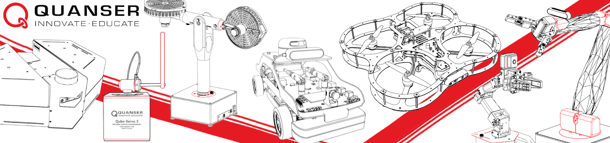

# Quanser_Academic_Resources
The [Quanser](https://www.quanser.com/) Academic Resources includes the research and teaching content for using Quanser products, including libraries, research examples, teaching content, user manuals, guides and more.

This repository includes content for the following products: `Qube-Servo 3, Aero 2, QArm, QArm Mini, QBot Platform and older QBots, QDrone, QDrone 2, QCar and QCar 2.`, and looking for resources on these solutions from [Quanser](https://www.quanser.com/) will redirect here. If you are looking for resources to other products, skip these instructions and refer to the section: [Resources For Older Products](#resources-for-older-products).

### Table of Contents
- [Downloading Resources](#downloading-resources)
- [Setting Up Your Computer](#setting-up-your-computer)
- [Getting Started With Content](#getting-started-with-content)
- [Resources For Older Products](#resources-for-older-products)
- [Changelog](changelog.txt)


## Downloading Resources

Before getting started with these resources, the first step is to download them into your computer. There is two ways to do this, using Git, or downloading the files simply as a .zip file. We recommend having our resources in a C:/Users/user/Documents/Quanser folder.

### With Git

<details open>
<summary>Installation using Git</summary>

1. Install [Git](https://git-scm.com/downloads) in your system.
2. Open your Documents folder and open a windows terminal in that folder.
3. Run the following command to create the Quanser directory and copy the contents of this repo in there.
    ```
    git clone https://github.com/quanser/Quanser_Academic_Resources.git Quanser
    ```

</details>

### Without Git

<details>
<summary>Installation without Git</summary>

1. On your system, create a folder called _Quanser_ under _Documents_. This should look like `C:/Users/user/Documents/Quanser`.
2. Click the green Code button at the top of this GitHub page, click _Download ZIP_ at the bottom of the menu that pops up.
3. Unzip the folder in your system.
4. Go into _Quanser_Academic_Resources-main_ (you see the folders 0_libraries, 1_setup ...). Copy all the contents of that folder into your newly created Documents/Quanser folder.
</details>

## Setting Up Your Computer

To begin using these resources, you will need to install the necessary software to your computer based on your intended method of interfacing with Quanser devices. This may involve working with either virtual and/or hardware systems, and utilizing Python and/or MATLAB/Simulink.

- Follow the setup guide: [Computer Setup](docs/pc_setup.md).

- Note that if a router was provided as part of your system: please DO NOT connect an internet cable to the router, this may cause unexpected behavior due to automatic router firmware updates.

## Getting Started With Content

For a comprehensive guide to getting started with these resources and using your Quanser product there are two guides to get started depending on your product.

For setup for a product that is part of the labs listed below, please refer to the [Getting Started - Labs](docs/start_labs.md) guide.

    - Autonomous Vehicles Research Studio (AVRS):
        - QDrone, QDrone 2, QBot 2, QBot 2e
    - Mobile Robotics Lab (MRL):
        - QBot Platform, QArm Mini
    - Self Driving Car Studio (SDCS):
        - QCar, QCar 2

For setup for any other device listed below, please refer to the [Getting Started - Others](docs/start_others.md) guide.

    - Aero 2
    - QArm
    - Qube-Servo 3


# Resources For Older Products

 **_For any other product not listed above, please visit the Quanser Website for [resources](https://www.quanser.com/resources/)._**
