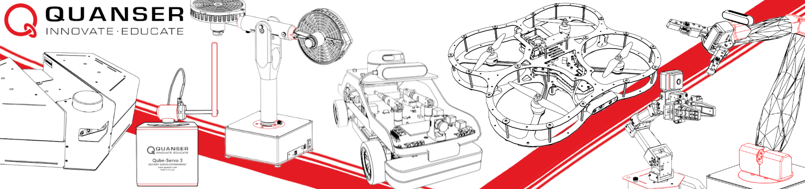

<p align="right"><a href="../README.md#setting-up-your-computer"><sup>Back To Guide</sup></a>
<br/>

# Setting up your computer

The following steps are how to set up your computer so you are ready to start using our resources. Follow the instructions for the software you will be using. If you are using both MATLAB and Python, follow the instructions in both sections. Make sure to follow the instructions at the bottom of this page to [complete the setup](#completing-the-setup).

## If you are using MATLAB/Simulink 

-  Download MATLAB/Simulink (https://www.mathworks.com/products/matlab.html).

### If using hardware 

- Download QUARC. It will install Quanser Interactive Labs, which is used when using virtual products. To download QUARC, go to [QUARC's Product Page](https://www.quanser.com/products/quarc-real-time-control-software/#panel1v) and click on the 4th tab `QUARC ___ Installer & Documentation`. Note that you will need the provided license file you got when receiving the system.

### If using virtual devices only
These steps are only necessary if you are not using hardware, and using virtual devices only. 

- Download Quanser Interactive Labs through the MATLAB Add On Explorer

    

    ```
    Quanser Interactive Labs for MATLAB
    ```

    

## If you are using Python
-  Make sure you have not downloaded Python through the Microsoft store, if you have, we recommend uninstalling it first. 

- Download Python 3.11, 3.12 or 3.13 through the Python foundation website (https://www.python.org/downloads/windows/).   
**Make sure to click on  the _Add Python to PATH_ option in the first screen of the installer**.

- If you do not have QUARC installed (due to virtual devices only or Python only setup), download [Quanser SDK](https://github.com/quanser/quanser_sdk), this GitHub repository links to both Windows and Linux versions.

### If you are ONLY using Python (No MATLAB/Simulink)

- If you are going to use Quanser's virtual devices, download [Quanser Interactive Labs](https://qlabs.quanserdocs.com/en/latest/Get%20Started.html).

# Completing the Setup

1. If you had to download any new software, restart your computer before continuing to make sure changes are recognized by the system. 

2. Once you have the necessary software in your computer, go to your Quanser folder with these resources and open the `1_setup` folder. Run `step_1_check_requirements`, this will make sure your computer has all the necessary files for the language/configuration you will use. This will generate a log file. 

3. Afterwards, run `configure_matlab.bat` and/or `configure_python.bat` depending on the language you will use. 

4. This will update environment variables on your system; restart your computer after running these files.


<p align="left"><a href="../README.md#setting-up-your-computer"><sup>Back To Guide</sup></a>
<br/>