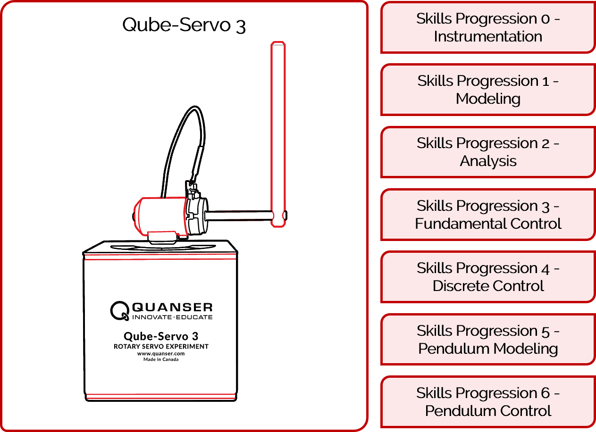
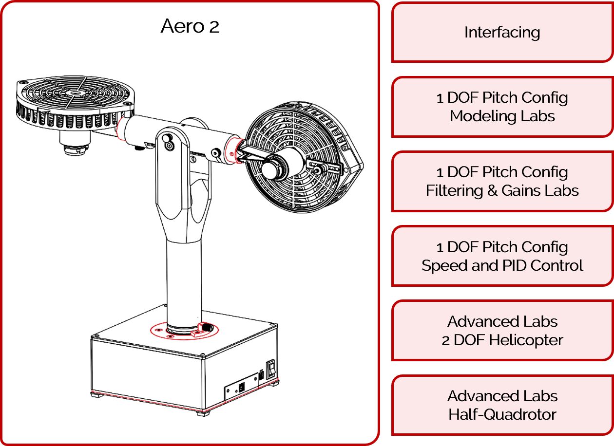
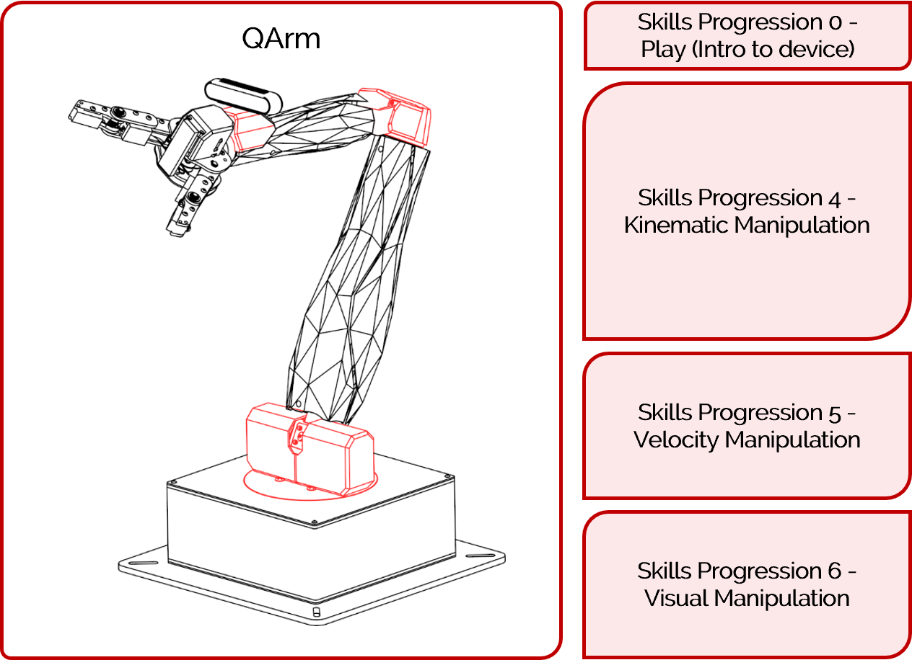
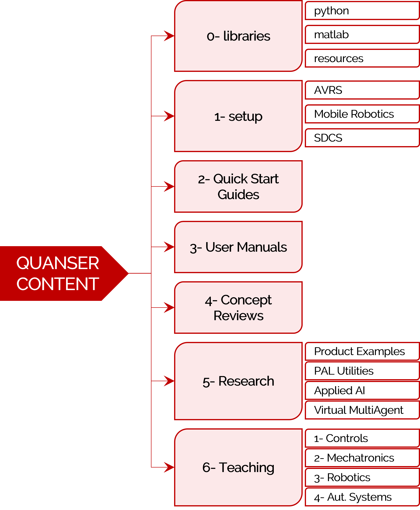

<a href="../README.md#getting-started-with-content">Back To Guide</a>
 

# Getting Started With Quanser's Other Products

This guide walks you through getting started with the following products: 

- [Qube-Servo 3](#qube-servo-3)
- [Aero 2](#aero-2)
- [QArm](#qarm)

If  your product is not listed above, use the [Getting Started - Labs](start_labs.md) guide. 

## Teaching Content

These products have full teaching curriculum. Each of their labs consists of the following documentation:

- **Concept Reviews**: 
    Independent reference material for student use that serves as a means for them to refresh the most important concepts and equations for any lab. These exist mostly in a separate concept_reviews folder in the Quanser folder or could be placed alongside the lab. 
- **Application Guides**: 
    Lab specific introduction that guides students towards why the lab is important and what they will learn as well as things they need to know before starting the lab. 
- **Lab Procedures**:
    Lab specific instruction manuals with guided steps to walk students through the lab, reflect on important considerations and take notes or screenshots and capture results.
- **Recommended Assessments**:
    Lab specific take home questionnaire that requires critical thinking and further analysis of lab results. The results from the lab procedure will be analyzed here by the student.

## Qube-Servo 3

The Qube-Servo 3 curriculum is written in MATLAB/Simulink and is broken down into a list of 7 pipelines in total with more than 16 labs.

Follow these steps to get started with your Qube:

1. Run through the quick start guide of your Qube-Servo 3 to make sure your hardware is functioning as expected. These files are located under `2_quick_start_guides/qube_servo3` and are separated by programming language (MATLAB/Python). Note that also individual IO tests and python examples are located in the product folder under `5_research`. 

2. Go through the user manual located under `3_user_manuals/qube_servo3`, for more detailed information on the device. 

3. Teaching content is located under `6_teaching/1_Controls/Qube_Servo_3`. The content for the Qube-Servo 3 is shown below. For more detailed information on these skills progressions, refer to the curriculum pipeline document under the `6_teaching/1_Controls/Qube_Servo_3` directory.  

    

For a more detailed description of the provided file directory, go to the [Directory Structure](#directory-structure) section.

**Note:** If needed, use the [Simulink Onramp](https://matlabacademy.mathworks.com/details/simulink-onramp/simulink), for help getting started with Simulink, or the [QUARC Demos](https://docs.quanser.com/quarc/documentation/quarc_demos.html) for help getting started with Quanser's QUARC. 

[Back to Top](#)   |   [Back to Guide](../README.md#getting-started-with-content)

## Aero 2

The Aero 2 curriculum is written in MATLAB/Simulink and has 10 labs for the 1DOF Pitch configuration of the device as well as 3 labs each for the advance configurations of 2DOF Helicopter and Half-Quadrotor. 

Follow these steps to get started with your Aero:

1. Run through the quick start guide of your Aero 2 to make sure your hardware is functioning as expected. These files are located under `2_quick_start_guides/aero2` and are separated by hardware and virtual devices. 

2. Go through the user manual located under `3_user_manuals/aero2`, for more detailed information on the device. 

3. Teaching content is located under `6_teaching/1_Controls/Aero_2`. The content for the Aero 2 is shown below.  

4. For more advanced examples as well as Python examples, refer to the product folder under `5_research`. 

For a more detailed description of the provided file directory, go to the [Directory Structure](#directory-structure) section.

**Note:** If needed, use the [Simulink Onramp](https://matlabacademy.mathworks.com/details/simulink-onramp/simulink), for help getting started with Simulink, or the [QUARC Demos](https://docs.quanser.com/quarc/documentation/quarc_demos.html) for help getting started with Quanser's QUARC. 

[Back to Top](#)   |   [Back to Guide](../README.md#getting-started-with-content)

## QArm

The QArm curriculum is written in MATLAB/Simulink and has over 10 labs divided in 3 skills progressions. 

Follow these steps to get started with your QArm:

1. Run through the quick start guide of your QArm to make sure your hardware is functioning as expected. These files are located under `2_quick_start_guides/qarm` and are separated by hardware and virtual devices. 

2. Go through the user manual located under `3_user_manuals/qarm`, for more detailed information on the device. 

3. Teaching content is located under `6_teaching/3_Robotics`. The content for the QArm is shown below.  

4. For more advanced examples as well as Python examples, refer to the product folder under `5_research`. 

For a more detailed description of the provided file directory, go to the [Directory Structure](#directory-structure) section.

**Note:** If needed, use the [Simulink Onramp](https://matlabacademy.mathworks.com/details/simulink-onramp/simulink), for help getting started with Simulink, or the [QUARC Demos](https://docs.quanser.com/quarc/documentation/quarc_demos.html) for help getting started with Quanser's QUARC. 

[Back to Top](#)   |   [Back to Guide](../README.md#getting-started-with-content)

## Directory Structure

Quanser content is subdivided into a series of directories to help you get started quickly. 

- **0_libraries**: Source location for custom Python/Simulink libraries, as well as other useful files used in the libraries. Please review `libraries_guide` inside the libraries folder for more information.

- **1_setup**: Setup for different lab products. 
- **2_quick_start_guides**: Standalone Quick Start Guides for various products. 
- **3_user_manuals**: PDF files of user manuals for different Quanser products.
- **4_concept_reviews**: Consists of .docx/.pdf files for background concepts utilized in Quanser Curriculum.
- **5_research**: Research and IO examples and in either Simulink/Python/ROS for different solutions provided by Quanser. (previously "examples" folder)
- **6_teaching**: Curriculum/lab content for various Quanser products for hardware or digital twins. 

[Back to Top](#)   |   [Back to Guide](../README.md#getting-started-with-content)
