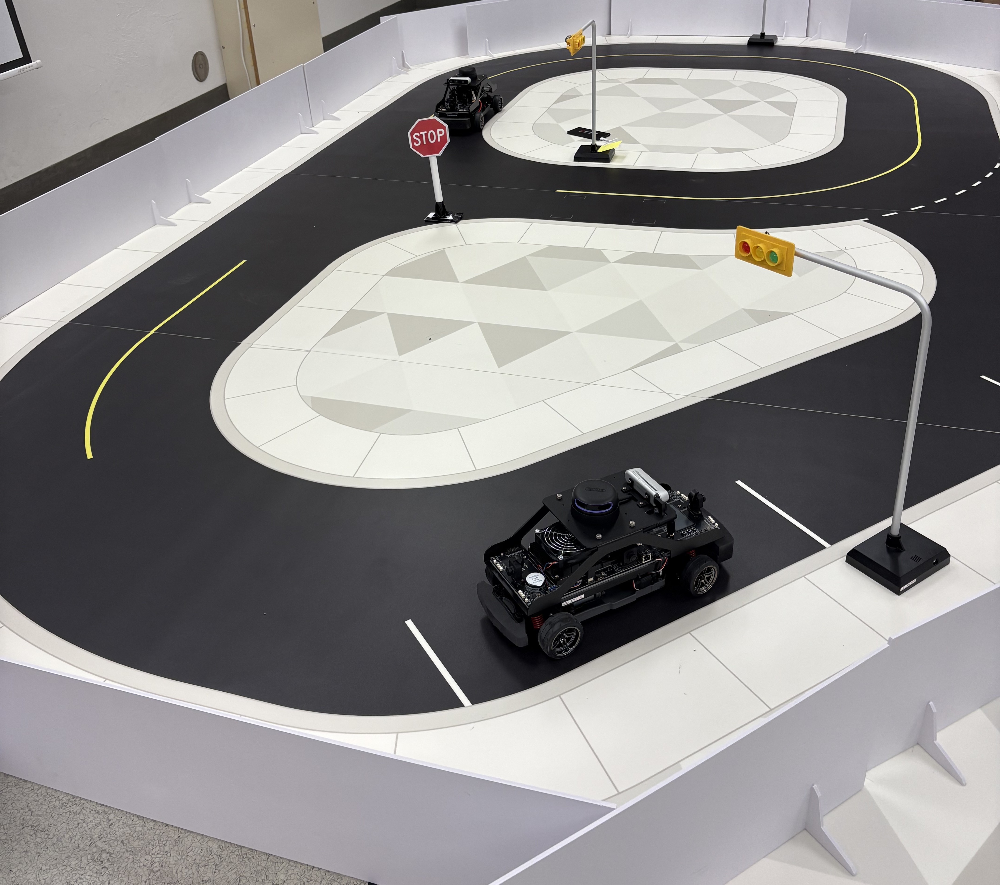

# ACL QCar Testbed

A repository for building and maintaining a reproducible autonomous-vehicle testbed in the **Autonomic Computing Lab (ACL), University of Arizona**. The testbed supports rapid experimentation, teaching, and demos on Quanser QCar platforms.


---

## Goals
- Provide a **reliable, reusable codebase** validated on ACL’s hardware.
- Enable **sensor fusion, perception, control, and V2V/V2I** experiments.
- Keep setup steps **documented and automatable** so new members can get started quickly.

---

## Testbed Hardware (Current)
- **QCar 2** × 2 units
- **QCar (Gen-1)** × 2 unit
- **Miniature road map / track**
- **Traffic lights & road signs** (scaled)


<p align="center">
  
  <br><em>QCar-2 on the mini map</em>
</p>

---

## Team

### Current Members
- **Chieh Tsai** — PhD Student, ECE Department, University of Arizona
- **Davronkhon Mukhamedaliev**, Undergraduate student, ECE Department, University of Arizona
- **Prof. Salim Hariri** — Professor, ECE; Faculty Advisor, Autonomic Computing Lab
- **Prof. Ehsan Azimi** — Assistant Professor of ECE and CS; Member of the Graduate Faculty (Co-Advisor)

### Former Members & Contributors
- **Murad Mehrab Abrar** — M.S. student, ECE department, University of Arizona 
- **Abdullah Alrashidi** — PhD student, AME department, University of Arizona 


---

## Tech Stack
- **Languages:** MATLAB / Simulink, Python
- **Operating Systems:** Windows and Linux (PC side)


---

## Quick Start — Quanser Software & Docs (PC)

### 🔗 Resource Links
- **Student Resources**  
  https://quanserinc.box.com/shared/static/9tob8mj31lkw6r8z4huh26behctlae4q.zip

- **Instructor Resources** *(restricted to instructors — do not share with students)*  
  https://quanserinc.box.com/shared/static/s8lrc6fxy6g10eb63b7u9m7ifxrfmxgy.zip

### 📄 Installation (Windows PC)
1. Unzip the package(s) above. Open the folder and **read `readme_user.txt`** for details on Simulink and/or Python configurations.
2. Run the following batch files **in order**:
   - `step_1_select_resources.bat` — choose which resources to use
   - `step_2_download_resources_instructor.bat` — download the selected packages
3. Navigate to `Documents\Quanser\1_setup` and run:
   - `configure_matlab.bat`
   - `configure_python.bat`
4. **Restart your PC** to apply environment-variable updates.

**Troubleshooting:** If you hit errors, capture the console output and open an issue with your OS version, MATLAB version, and Python version.

---

## Repository Layout
> _Suggested structure; adjust as the project evolves._
## Acknowledgments
- **Quanser** for QCar platforms, examples, and educational materials.
- **Autonomic Computing Lab (ACL)**, University of Arizona.

---

## Media
<p><a href="https://drive.google.com/drive/folders/1xbBjV_lVEsi4IpfXneyjky1al9OLNP3d?usp=drive_link">📁 View research media on Google Drive</a></p>


## Citation 
If this repository supports a publication, please cite it appropriately. 

```bibtex
@misc{acl_qcar_testbed,
  title  = {ACL QCar Testbed},
  author = {Tsai, Chieh and Hariri, Salim and ACL Contributors},
  year   = {2025},
  howpublished = {\url{https://github.com/<org>/<repo>}},
  note   = {Quanser QCar testbed code and docs}
}
